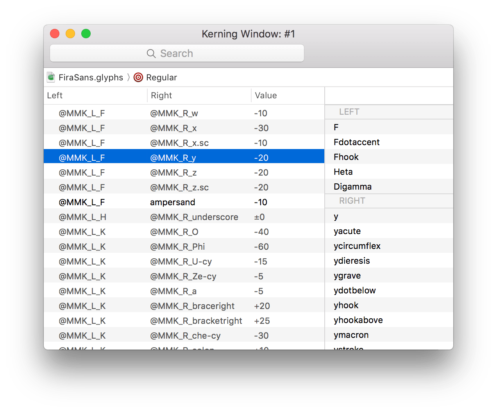
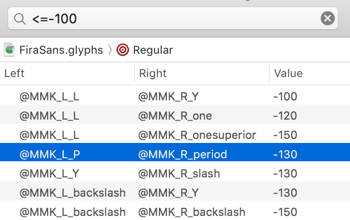

# KerningClasses.glyphsPlugin

A Glyphs plugin to examine kerning values with a plain old interface.

## Installation

1. Download the ZIP archive and unpack it, or clone the repository.
2. Double-click the `.glyphsPlugin` in the Finder. Confirm the dialog that appears in Glyphs.
3. Restart Glyphs.

## Usage

**Open a new window:** Choose File > New Kerning Window.

**Switch to the other masters:** Click the jump bar below the search field and choose a master from the pop-up menu.

**Examine kerning exceptions:** Click the disclosure triangles to expand. Exceptions will be automatically grouped and listed as subitems. Note that orphaned exceptions – whose kerning groups leave their kerning values undefined – are marked in red, and class-to-class kerning pairs are displayed with grey.

**Customise colours in the list:** Edit the file `Colors.json` to configure the text colour for each type of pairs. The file is located at the following path: `KerningClasses.glyphsPlugin/Contents/Resources/Colors.json`.

**Filter values in the list:** Enter text into the search field to find the glyphs in interest. To filter out the list by kerning values, the following comparators can be used: `=`, `<`, `>`, `<=` and `>=`. For instance, enter `<= -100` to list the pairs that have been tracked more than `-100`.

**Make combinations:** Select one or more pairs in the list. Double-click or press `Shift` + `Enter` to display the text that covers all the combinations for the selected pairs in the current tab.

**See what’s included in the pairs:** Select one or more pairs in the list. The aggregated list of glyphs for the selected pairs is shown in the right column. If you select one or more of glyphs, their combinations will be automatically set in the current tab.

**Copy metrics:** Select one or more pairs in the list. To copy the metrics values, right-click the selected items and choose Copy Metrics from the contextual menu. The values are copied as semicolon separated values, or you can directly paste them into the Kerning window which is shipped with Glyphs.

## Limitation

- The plugin cannot handle 3-level deep kerning exceptions at the moment. The codebase needs some overhaul to fix that.

## Requirements

Tested with Glyphs 2.3 on OS X 10.11.

## License

TBD
