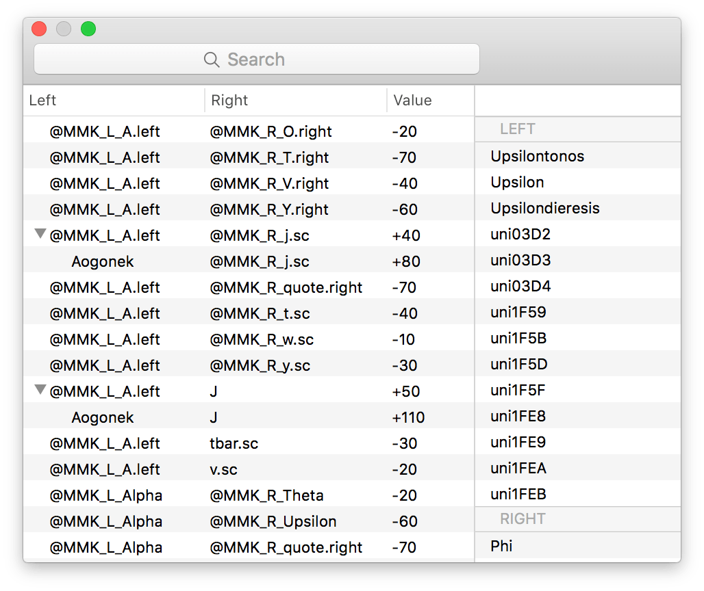

# KerningClasses.glyphsPlugin

A Glyphs.app plugin to examine kerning values in a plain old interface.

## Installation

1. Download the ZIP archive and unpack it, or clone the repository.
2. Double-click the `.glyphsPlugin` in the Finder. Confirm the dialog that appears in Glyphs.
3. Restart Glyphs.

## Usage

1. Select [Window] - [Kerning Classes] from the menu.
2. In the dialog, the kerning pairs are enumerated as a list.
3. Exceptions will be automatically grouped and listed as subitems. Click the disclosure triangles to expand.
4. Use the search field to find the glyphs in interest. By default, it lists the pairs that matches with the text you have entered. To filter them out by kerning values, the following comparators can be used: `=`, `<`, `>`, `<=` and `>=`. For instance, enter `<= 100` to list the pairs that have been tracked more than `-100`.
5. The right pane is where you can see the possible list of glyphs for the selected kerning pairs. If you select one or more of these, the text that covers all the kerning combinations will be set in the current Font tab.

## Tips

- The following comparators can be used to filter by value: `=`, `<`, `>`, `<=` and `>=`. (e.g. `<= 100` to list the pairs tracked more than `-100`)

## Requirements

Tested with Glyphs 2.4 on OS X 10.11. Might just work with later versions, or older versions if you have a luck.

## License

TBD
